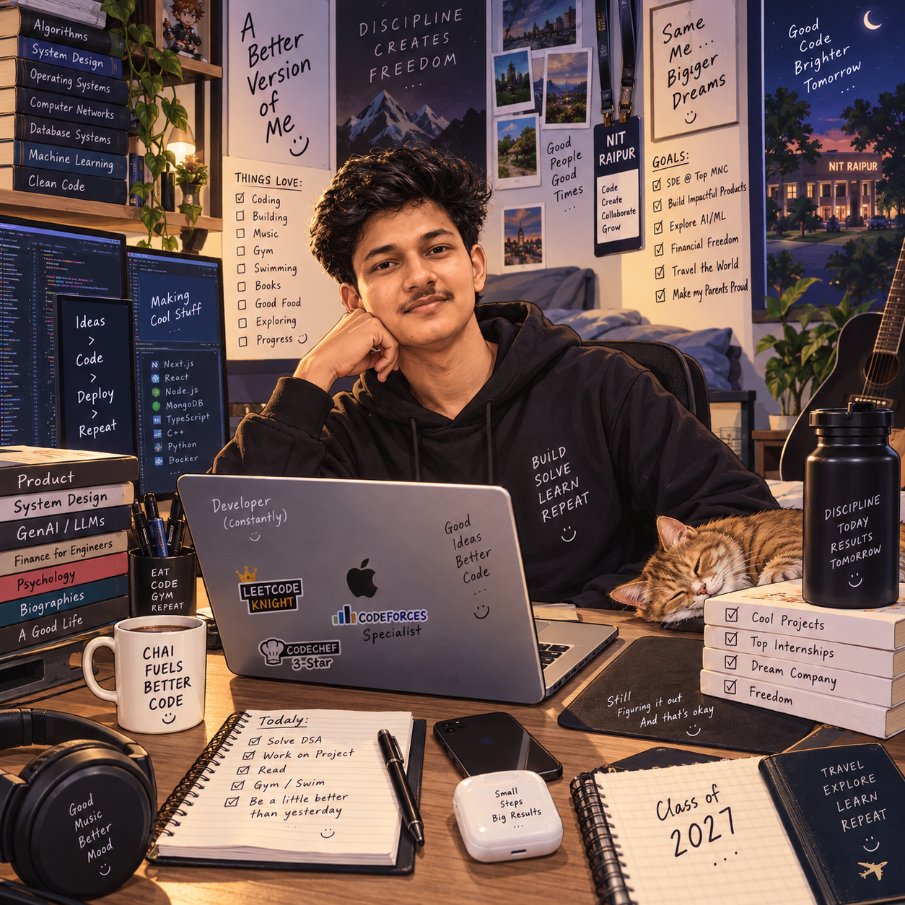

# Hey, I'm Abhay 👋

### Backend & Full-Stack Engineer · NIT Raipur CSE '27

**From an API request to a completed job — I enjoy building what happens in between.**

I build backend services, event-processing systems, and real-time products with TypeScript and Node.js.

 

---

## 🧭 What drives my work

I'm a **Computer Science undergraduate at NIT Raipur (2023–2027)** with a **CGPA of 8.2/10**. My interests sit where backend development meets platform engineering: API design, queues, retries, service orchestration, and observability.

I like working through the questions behind a feature: *What happens if a request arrives twice? If a worker fails? If an external API stops responding?*

- **Building:** event-processing services and real-time messaging experiences.
- **Engineering focus:** idempotency, authorization, failure recovery, and measurable system behavior.
- **Beyond implementation:** documenting architecture, testing APIs, and making changes easier to review.
- **Open to:** SDE internships and backend or full-stack opportunities for 2027.

## 🛠️ Selected builds

### ⚙️ EventForge — Give every event a path to completion

**A multi-tenant event-processing and job-queue platform with separate API and worker processes.**

[Explore the code](https://github.com/abhikhurannah/EventForge) · [Live demo](https://event-forge-kappa.vercel.app/)

`React` `TypeScript` `Fastify` `MongoDB` `Redis` `BullMQ` `Docker Compose`

- Built **idempotent event ingestion**, priority queues, exponential retries, and dead-letter recovery.
- Implemented project-scoped authorization, shared rate limits, and **HMAC-signed webhooks** with independent retries.
- Exposed job-state, failure-rate, and intake-to-completion latency metrics to make processing behavior visible.

> **Measured locally:** across three Docker load-test bursts using a reference event handler, 1,500 events at 10 concurrent requests achieved **404–712 accepted requests/s** and **31–57 ms p95 ingestion latency**. All measured events completed successfully. These are local test results, not production throughput claims.

### 💬 Chatty AI — Real-time conversations, thoughtful AI assistance

**A messaging platform with online presence, image sharing, and Gemini-powered conversation tools.**

[Explore the code](https://github.com/abhikhurannah/Chatty-AI) · [Live demo](https://chatty-ai-dusky.vercel.app/)

`React` `TypeScript` `Node.js` `Express` `MongoDB` `Socket.IO` `Cloudinary` `Gemini API`

- Persisted messages through REST APIs **before targeted Socket.IO delivery** and cleaned up listeners when switching conversations.
- Implemented JWT authentication with HTTP-only cookies and Bearer tokens for cross-origin deployment; documented architecture, authentication, and API flows.
- Added AI reply suggestions, typing autocomplete with **600 ms debouncing**, conversation analysis, and fallback responses when the AI API fails.

## 💼 Where I've contributed

### Web Developer Intern · AshwaQuant Pvt. Ltd.
*May 2025 – July 2025*

- Developed Node.js and Express REST APIs for form submissions and lead capture.
- Integrated a third-party payment gateway into the onboarding workflow.
- Built and deployed a responsive React website using reusable components; tested and debugged APIs with Postman and managed changes with Git.

### Technical Core Coordinator · Technocracy, NIT Raipur
*May 2024 – Present*

- Maintained the React/TypeScript and Node.js portal and coordinated feature delivery with the technical team.
- Created reusable React components and configured GitHub Actions CI/CD.
- Documented changes for review and introduced a code-review checklist before merging.

## 🧰 Tools behind the work

| Area | Technologies & concepts |
| :--- | :--- |
| **Languages** | C++, Python, JavaScript, TypeScript, SQL |
| **Backend** | Node.js, Express.js, Fastify, REST APIs |
| **Data & queues** | MongoDB, Redis, BullMQ |
| **Platform engineering** | Distributed systems, service orchestration, queues, retries, observability, API design |
| **Frontend & real-time** | React, Socket.IO |
| **Development & delivery** | Git, GitHub, GitHub Actions, Docker Compose, Linux/UNIX, Postman |
| **Foundations** | Data structures & algorithms, OOP, operating systems, computer networks, DBMS |

## 🏆 Milestones along the way

| Achievement | Detail |
| :--- | :--- |
| **LeetCode** | Knight · **1973** |
| **Codeforces** | Expert · **1638** |
| **CodeChef** | 3-Star · **1697** |
| **Economic Times Gen AI Hackathon 2025** | Winning team — [NewsNavigator](https://github.com/abhikhurannah/news-intel-story-spark) |
| **Amazon ML Challenge 2025** | All India Rank **818** |
| **GATE 2026** | Qualified — Computer Science and Engineering |
| **KVPY Scholar 2022** | All India Rank **2000** |

---

### Build. Observe. Improve. Repeat.

Interested in backend systems, real-time products, or building something useful together?

[Let's connect](https://www.linkedin.com/in/abhay-kumar101/) · [Drop me a note](mailto:abhaykumar.official101@gmail.com)

